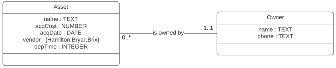

<!-- better to add logo in screen recording (OBS can blend in) and graphic on first slide -->
<!-- https://openscience.nuance-r.com/ioslides_presentation_format.html#figure_options -->

```{r setup, include=FALSE}
knitr::opts_chunk$set(echo = FALSE)
```

<!-- code below is to inject footer (by Martin Schmelzer) -->
<script src="https://ajax.googleapis.com/ajax/libs/jquery/1.12.2/jquery.min.js"></script>

<script>
    $(document).ready(function() {
      $('slide:not(.title-slide, .backdrop, .segue)')
       .append('<footer label=\"Essential SQL\"></footer>');    
    })
</script>

<style>
  footer:after {
    content: attr(label);
    font-size: 12pt;
    position: absolute;
    bottom: 20px;
    left: 60px;
    line-height: 1.9;
  }
</style>

# Introduction

## Slide with Image | Querying Data




plain text under <span class="red2">image</span> without bullets

## Slide with Code and Callout

<!-- live SQL: https://bookdown.org/yihui/rmarkdown/language-engines.html#sql -->

```{sql, eval = FALSE, echo = TRUE}
select name, salary, title 
### <b>
  from employees e
### </b>
 where e.salary > 100000;
```

<!-- press 'h' to fade away rest of code when presenting -->

----
New slide without a header

## Slide with Math

$evenNums=\{2, 4, 6, ..., 100\}$

## Definition

An object is a single member of a class, i.e., an object $o$ that belongs to class $C$ is denoted either as $o^C$ or $o \in C$. 

## Two-Column Slide {.build}
<div class="columns-2">
  - Bullet 1
  - Bullet 2
  - Bullet 3
</div>

<div class="notes">
This is my *note*.

- It can contain markdown
- like this list
</div>

## Slide with Bullets Small Text {.smaller .build}
Transition Speed

- Bullet 1
- Bullet 2
- Bullet 3

## Slide with Bullets Regular Text
Transition Speed

- Bullet 1
- Bullet 2
- Bullet 3

## Slide with SQL Output

```{sql, eval = FALSE, echo = TRUE}
select * from employees;
```

## Slide with R Output

```{r cars, echo = TRUE}
summary(cars)
```

## Slide with Plot

```{r pressure}
plot(pressure)
```

